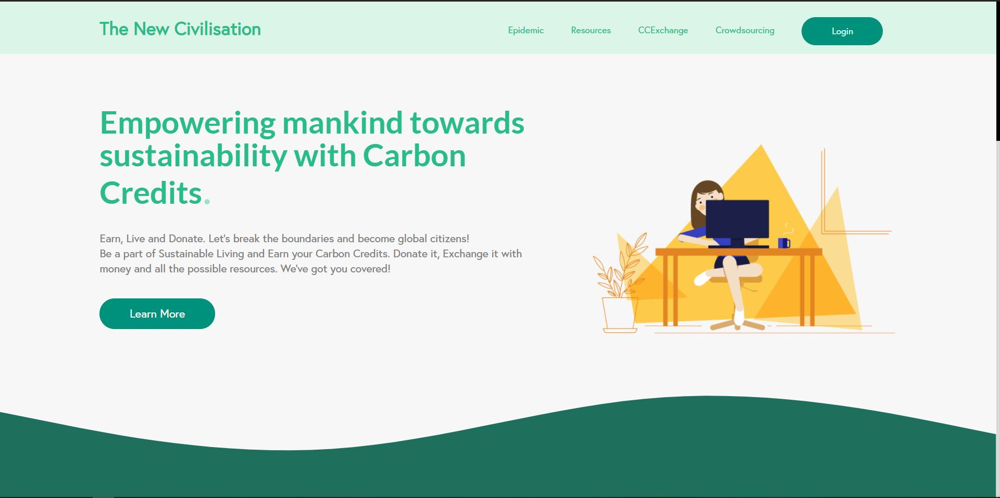
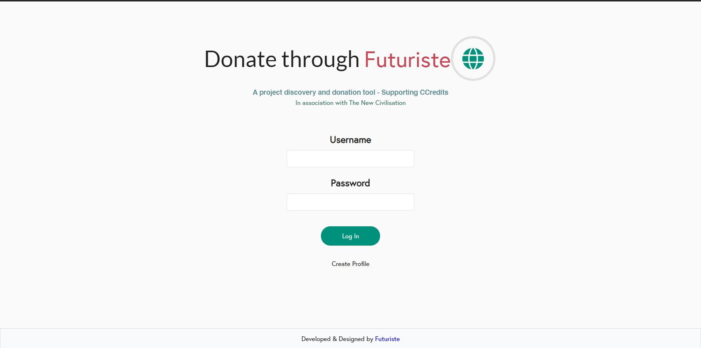
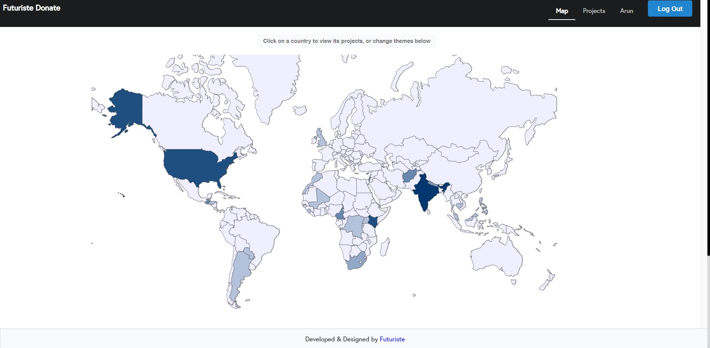
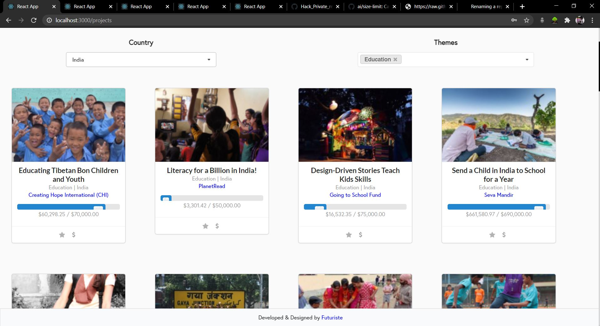
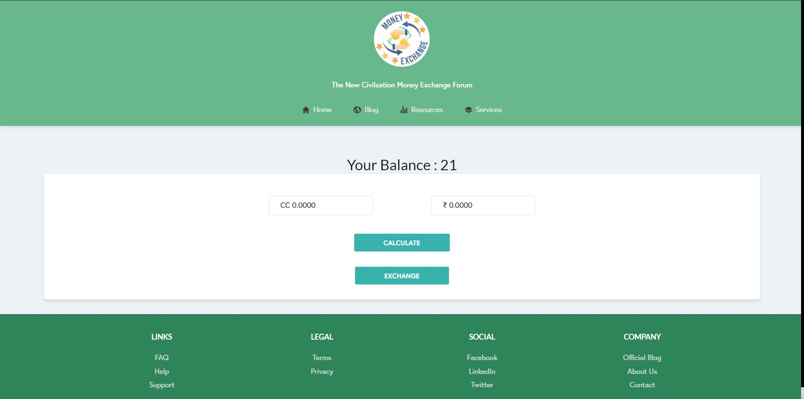
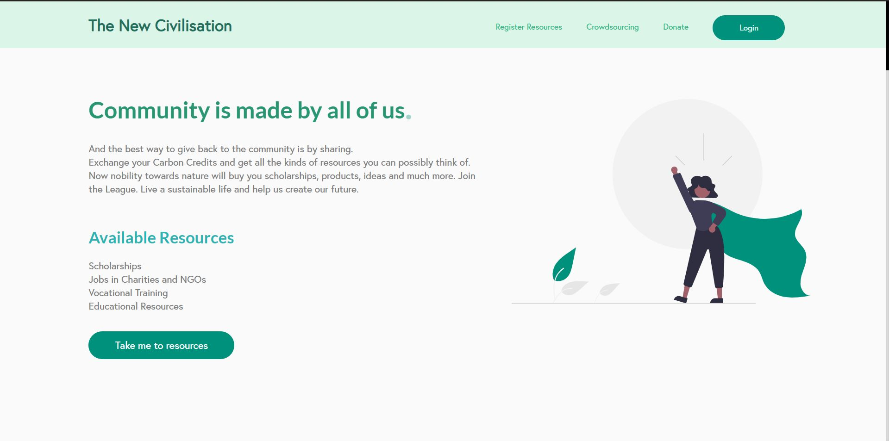
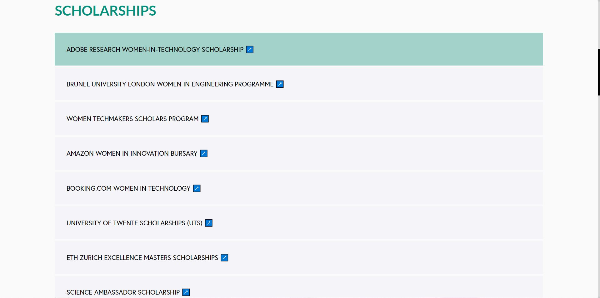
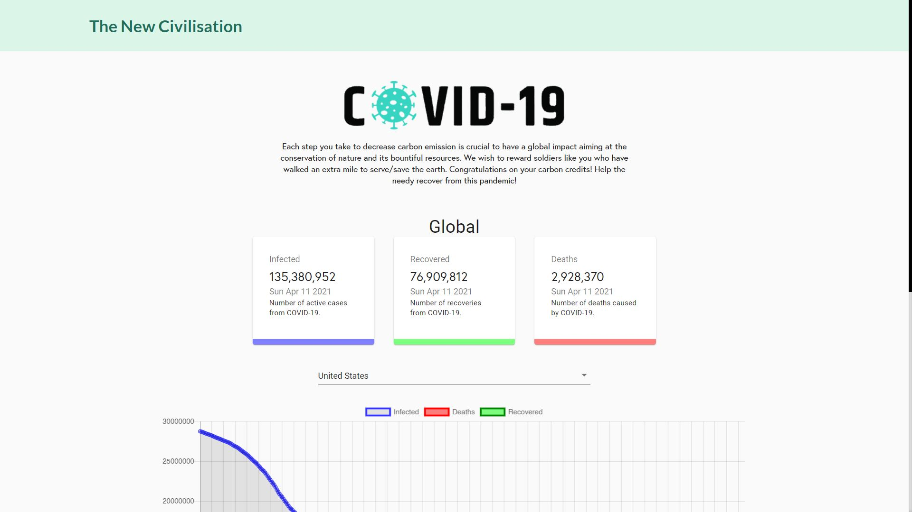
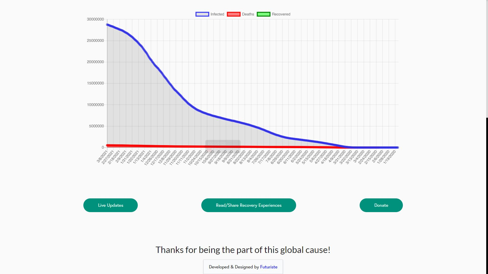

# The New Civilisation

## Just one App targeting Pollution, Social Development, Global Currency and Global Brotherhood and well-being.

### Earn Carbon Credits by reducing your CO2 emission, get paid for your courtesy. Take mankind to sustainable living and give it a future.

The New Civilisation provides you a platform to earn credits when you move in the direction
of sustainable development. We call this decentralised currency as carbon credits. If you are
the reason for 1 tonne of CO2 emission, your carbon credit will be reduced by unity, and
increased by one if you move towards sustainability.


How can you reduce carbon emission :

- **Buy Sustainable Clothing and equipments** , and earn carbon credits.
- Follow **Reduce, Reuse, Recycle** principal, donate your unused item to the
  regulating authority and Carbon Credits.
- **Cycle today and leave your Car** because your CO2 tracker will reduce your
  earned Credits.
- Donate to **charities and global well-being**, earn credits and share it to the underprivileged.

Features of our app :

- **Crowdsourcing/Donation**, in this tab you can choose a field to donate in and it will show you a global map
  .The map will highlight the areas where most number of projects are going on in that particular field. You can donate your crabon credits with one click.

- Carbon credits are **Decentralised Money** so theirs no regulating authority. Its one credit transfer system that will help in
  globalisation. It will join the community in the cases where we've to fight collectively like pollution, global warming.
  regulating authority and Carbon Credits.

- **Section for Women and Children** in the resources tab is present where Carbon Credits can be exchanged for scholarships,
  jobs in NGO/charities, vocational training and much more.

- Earned your credits? **Now exhange them for your local currency!**, compare it, exchange it donate it.

- We have this special section towards empathy. **Directly talk to the people you donate to!** Your small contribution
  can be a big change in their life. Talk to them in the **Read and Share Experience** Tab.

  -**A special tab is provided for epidemics also.** For COVID-19 , you can donate your credits directly to WHO. Talk directly to the people who benefitted from your credits in the **Read and Share Experience** Tab.

  <p align="center">
  
</p>


<p align="center">
  
</p>

<p align="center">
  
</p>

<p align="center">
  
</p>

<p align="center">
  
</p>

<p align="center">
  
</p>

<p align="center">
  
</p>

<p align="center">
  
</p>

<p align="center">
  
</p>


### This is a React App - To install it
```yaml
git clone https://github.com/arunmishra2000/Hack_Private_repo.git
```
```yaml
npm install
```
```yaml
npm start
```


